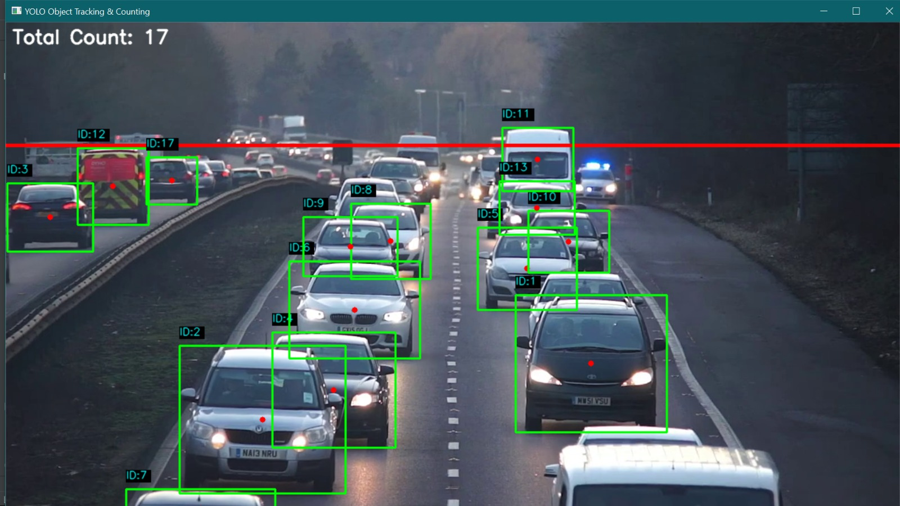
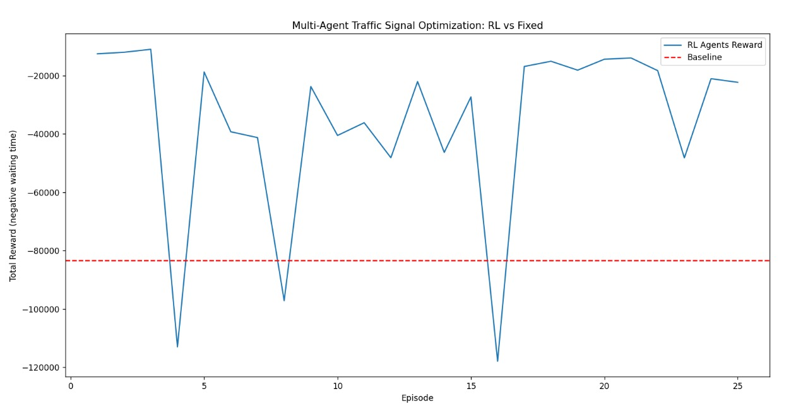

# Smart AI Traffic Management System

An AI-powered traffic management system developed for **Smart India Hackathon 2025 (SIH)** to address urban traffic congestion through **computer vision and reinforcement learning**.

The system combines **YOLO-based vehicle detection and tracking** with **Q-learning-based traffic signal optimization** in a **SUMO simulation environment**

## Smart India Hackathon 2025

* **Problem Statement ID:** SIH25050
* **Problem Statement:** Smart AI Traffic Management System for Urban Congestion
* **Theme:** Transportation & Logistics
* **Category:** Software
* **Team Name:** ApexCoders
* **Team ID:** 76169
* **Idea:** Adaptive Flow: Reinventing the Traffic Light

## 📌 Project Overview

The system combines **YOLO-based computer vision** with **reinforcement learning** to monitor traffic conditions and optimize traffic signal control.

The computer vision component detects and tracks vehicles from traffic video, while the reinforcement learning component uses traffic-state information to learn adaptive traffic-light phase selection in a **SUMO simulation environment**.

The current repository contains the implemented:

- Computer vision
- Vehicle tracking
- Reinforcement learning
- SUMO/TraCI simulation
- Flask backend
- Experimental results
- Demonstration video

---

## 🧠 Key Components

### 1. Computer Vision

The vehicle detection and tracking module uses:

- YOLO
- OpenCV
- Object tracking
- Vehicle counting
- Vehicle classification

Detected vehicles are assigned tracking IDs and displayed using:

- Bounding boxes
- Centroids
- Tracking IDs
- Total vehicle count

The current implementation monitors vehicle categories including:

- Cars
- Motorcycles
- Buses
- Trucks
- Autos
- Rickshaws

> Vehicle classes depend on the YOLO model and class definitions available in the implementation.

---

### 2. Reinforcement Learning

The traffic signal optimization module uses **Q-learning** with SUMO.

The RL agent:

1. Observes traffic conditions from controlled lanes.
2. Calculates the number of halted vehicles.
3. Selects a traffic-light phase.
4. Receives a reward based on traffic waiting time.
5. Updates its Q-table.
6. Repeats the process to improve signal control.

The reward is based on negative total waiting time, so lower traffic waiting time produces a better reward.

### 3. Backend

The backend is implemented using:

* Flask
* Flask-SocketIO
* OpenCV
* YOLO

It provides:

* Traffic monitoring
* Real-time traffic data
* Video-frame streaming
* REST API endpoints
* Start/stop monitoring controls
* Real-time browser updates through Socket.IO

API Endpoints
GET  /api/traffic-data
POST /api/start-monitoring
POST /api/stop-monitoring

The backend is designed to process a video source or webcam and stream processed frames to a browser client.

### 4. Traffic Simulation

The reinforcement learning component communicates with SUMO through TraCI to simulate traffic and control traffic-light phases.

SUMO provides the simulated traffic environment while the Q-learning agent selects traffic-light phases based on traffic conditions.

## System Architecture

```text
             Traffic Video / Camera
                       │
                       ▼
              ┌─────────────────┐
              │   YOLO + OpenCV │
              │Vehicle Detection│
              │   & Tracking    │
              └────────┬────────┘
                       │
                       ▼
              Traffic Information
                       │
             ┌─────────┴─────────┐
             │                   │
             ▼                   ▼
      Flask Backend         RL Controller
             │                   │
             ▼                   ▼
       Socket.IO/API       SUMO + TraCI
             │                   │
             ▼                   ▼
         Dashboard        Adaptive Signal
```

## 📊 Evaluation

The reinforcement learning system was evaluated against a fixed-signal baseline using total waiting time as the reward metric.

The generated results include multiple RL reward curves compared against a fixed baseline.

The repository also contains vehicle-tracking outputs showing detected vehicles, tracking IDs and vehicle counts.

## Results

### Vehicle Detection and Tracking

The computer vision experiments demonstrate:

- Vehicle detection
- Object tracking
- Tracking IDs
- Bounding boxes
- Vehicle counting

Example outputs are available in the `results/` directory.

### Reinforcement Learning

The RL experiments compare learned traffic-signal control against a fixed-signal baseline using negative waiting time as the reward.

The repository contains results from different numbers of training episodes.

### Result Files

The repository contains the following experimental outputs:

### Vehicle Detection



### Reinforcement Learning



### Demo Video

A demonstration video of the traffic monitoring system is available in the repository.

Video: videos/traffic_management_demo.mp4

The demo showcases:

- YOLO-based vehicle detection
- Vehicle tracking
- Tracking IDs
- Bounding boxes
- Vehicle counting
- Traffic monitoring

## 🛠️ Technologies

| Component               | Technology     |
| ----------------------- | -------------- |
| Programming             | Python         |
| Computer Vision         | YOLO, OpenCV   |
| Reinforcement Learning  | Q-learning     |
| Traffic Simulation      | SUMO, TraCI    |
| Backend                 | Flask          |
| Real-time Communication | Flask-SocketIO |
| Visualization           | Matplotlib     |
| Numerical Processing    | NumPy          |


## 📁 Project Structure

```text

Smart-AI-Traffic-Management-System/
│
├── README.md
├── requirements.txt
├── .gitignore
│
├── backend/
│   └── app.py
│
├── computer_vision/
│   └── vehicle_tracking.py
│
├── reinforcement_learning/
│   └── rl_agent.py
│
├── results/
│   ├── README.md
│   ├── vehicle_tracking_count_17.jpeg
│   ├── vehicle_tracking_count_57.jpeg
│   ├── rl_vs_baseline_10_episodes_1.jpeg
│   ├── rl_vs_baseline_10_episodes_2.jpeg
│   ├── rl_vs_baseline_25_episodes.jpeg
│   ├── rl_vs_baseline_25_episodes_1.jpeg
│   └── rl_vs_baseline_50_episodes_1.jpeg
│
└── videos/
    ├── README.md
    └── traffic_management_demo.mp4

```

### ⚙️ Installation

1. Clone the Repository
git clone https://github.com/Vikas-Gudimetla/Smart-AI-Traffic-Management-System.git
cd Smart-AI-Traffic-Management-System

2. Install Python Dependencies
pip install -r requirements.txt

### Running the Backend

1.Run the Flask backend using:
python backend/app.py

2.The application is configured to run at:
http://localhost:5000

The backend expects:

- A compatible YOLO model
- A video source or webcam
- Required Python dependencies

### Running the Reinforcement Learning Simulation

The reinforcement learning implementation uses SUMO and TraCI.

Before running the RL simulation:

* Install SUMO.
* Configure your SUMO simulation files.
* Update the SUMO configuration path in:
* reinforcement_learning/rl_agent.py
* Run the RL agent.

** Important **

The RL code contains a local Windows-specific SUMO configuration path.

This path must be changed to the user's own SUMO configuration file before running the simulation.

Example:

CONFIG_FILE = r"path/to/your/osm.sumocfg"

### 📈 Evaluation

The reinforcement learning system was evaluated against a fixed-signal baseline using total waiting time.

The generated plots show:

* RL agent reward
* Fixed-signal baseline
* Traffic waiting-time based reward
* RL behavior across different numbers of episodes

Because the reward is defined as negative waiting time, values closer to zero represent lower total waiting time.

The repository also contains computer-vision outputs demonstrating vehicle detection, tracking and counting.

## Current Implementation

This repository currently contains the implemented:

* Computer-vision component
* YOLO-based vehicle tracking
* Reinforcement-learning component
* SUMO/TraCI simulation
* Flask backend
* Flask-SocketIO real-time communication
* Experimental results
* Demonstration video
* Components Not Currently Implemented

The original SIH proposal described additional system components, including:

* Kafka
* SQL/database components
* A separate web frontend/dashboard

These components are not currently implemented in this repository and should not be considered part of the implemented system unless corresponding source code is added.

The current Flask backend provides the backend/API and real-time communication functionality.

## Project Goals

* Reduce vehicle waiting time at intersections
* Adapt traffic-light phases according to traffic conditions
* Detect and monitor vehicles automatically
* Evaluate adaptive traffic control using simulation
* Provide real-time traffic monitoring capabilities

### Future Improvements

Possible future improvements include:

* More extensive RL training
* Improved state representation
* More advanced traffic-signal phase selection
* Larger and more diverse traffic datasets
* Improved vehicle classification
* More realistic SUMO traffic scenarios
* Improved dashboard visualization
* Evaluation using additional traffic metrics
* Integration of additional system components proposed during the SIH solution design

## Team

### ApexCoders

**Smart India Hackathon 2025**

**Team ID:** 76169

**Team Leader:** Gudimetla Vikas

This project was developed collaboratively by the ApexCoders team as part of Smart India Hackathon 2025.

## 📄 SIH Documentation

The project was developed around the Smart India Hackathon 2025 problem statement:

SIH25050 — Smart AI Traffic Management System for Urban Congestion

The original SIH solution included the proposed technical approach, feasibility analysis, expected impact and system architecture.

## ⚠️ Note

This repository represents the implementation and experimental work currently available from the project.

Performance figures from the original SIH proposal should not be interpreted as measured results unless they are supported by corresponding experiments and outputs included in this repository.


**Important:** Copy only the content inside the box, starting from `# Smart AI Traffic Management System` and ending with the final sentence. Don't copy the outer ```markdown and ``` lines into GitHub.
